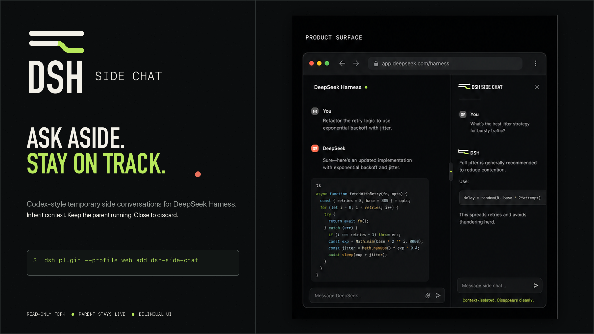
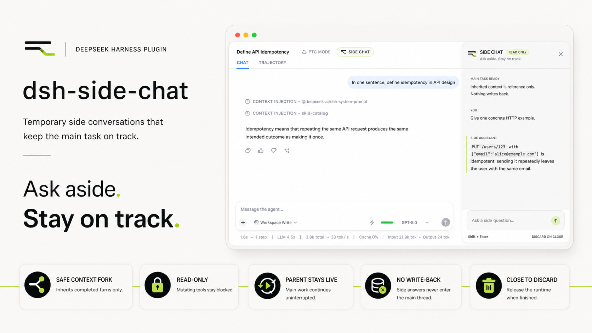

<p align="center">
  
</p>

<h1 align="center">dsh-side-chat</h1>

<p align="center">
  Codex-style temporary side conversations for DeepSeek Harness.
</p>

<p align="center">
  <a href="README.md">English</a> · <a href="README.zh.md">简体中文</a>
</p>

<p align="center">
  
  
  
</p>

> **Ask aside. Stay on track.** Open a focused drawer that inherits the completed parent context, ask a temporary question, then close it without writing the exchange back into the main conversation.

<p align="center">
  
</p>

## Why Side Chat?

Long coding conversations accumulate decisions, plans, and in-flight work. A small clarification can pull the main agent away from that trajectory. Side Chat gives the clarification its own child runtime while keeping the parent visible and independent.

- **One-click drawer:** additive header action plus a responsive overlay that chooses a full rail, compact rail, or bottom sheet.
- **Collision-aware placement:** measures the rendered AppFrame, native sidebar/details, sibling overlays, and marked portal controls without replacing a native slot.
- **Context inheritance:** forks only through the latest completed `turn/end`, never through a half-finished turn.
- **Parent independence:** the main conversation keeps running and receives no report or follow-up from the child.
- **Read-only by construction:** sandbox mode, approval policy, model-visible allowlist, and an execution-time deny-by-default guard.
- **Per-task retention:** switching conversations parks the Side Chat instead of deleting it; returning restores the transcript and live child.
- **Explicit lifecycle:** visible or generating chats stay alive; close ends immediately, while 30 minutes parked and idle triggers Host-owned cleanup.
- **Live transcript:** the Host projects only child-local messages while the drawer uses an adaptive 220–700 ms refresh loop.
- **English and Chinese UI:** follows the active Harness locale.
- **Keyboard friendly:** press `Cmd/Ctrl + Shift + .` to open or close.

## Install

### From npm

```bash
dsh plugin --profile web add @lukeknow0/dsh-side-chat
```

### From GitHub

```bash
dsh plugin --profile web add github:Lukeknow0/dsh-side-chat
```

Restart the running `dsh web` process after installation, then refresh the existing Harness page.

### From a local checkout

```bash
git clone https://github.com/Lukeknow0/dsh-side-chat.git
cd dsh-side-chat
pnpm install
pnpm run check
dsh plugin --profile web add .
```

When `dsh` is being run directly from a DeepSeek Harness source checkout, use its package script:

```bash
pnpm dsh plugin --profile web add /absolute/path/to/dsh-side-chat
```

## Use

1. Finish at least one turn in a normal parent conversation.
2. Select **Side Chat** in the conversation header, or press `Cmd/Ctrl + Shift + .`.
3. Ask a focused side question. The drawer can inspect inherited context and read-only resources. Its placement adapts without remounting when panels or the viewport change.
4. Switch tasks freely: the drawer is parked by parent and reappears with its transcript when you return.
5. Close the drawer with the close button, Escape, the shortcut, or the header action when you want to end that Side Chat.

A parent can own one retained Side Chat at a time. Visible drawers and actively generating children do not consume the lease. After the drawer is parked or detached and the child is idle, the Host keeps it for 30 minutes. Explicit close ends it immediately. Reloading the page can reattach to the retained Host conversation when you open Side Chat again.

## Safety model

Side Chat applies four monotonic controls to its child agent:

| Layer | Behavior |
| --- | --- |
| Fork boundary | Copies only the balanced event prefix through the latest completed turn |
| Policy override | Appends `sandboxMode: read-only` and `approvalPolicy: never` after the inherited seed |
| Tool visibility | Exposes only read-oriented tools that are actually available in the parent composition |
| Execution guard | Denies every unknown or non-read-only tool, including nested Code Mode dispatch |

The tool guard is the final authority. Adding a new tool to Harness does not silently grant it to Side Chat.

### Important cleanup disclosure

**Temporary does not mean guaranteed physical erasure on DSH 0.1.0-rc.7.** That release exposes no public API for deleting a durable session log. On explicit close or idle expiry, this plugin:

1. removes client admission and ignores late callbacks;
2. aborts a pending start or cancels active work;
3. disposes the live `AgentHandle`, removing the child from the active runtime;
4. calls the public workspace archive API when available.

The archived session log may remain on disk. This project does not unlink private persistence files or depend on unstable internal storage paths. See [SECURITY.md](SECURITY.md).

## How it works

```mermaid
sequenceDiagram
  participant U as User
  participant D as Side drawer
  participant H as SideChatService
  participant P as Parent agent
  participant C as Child agent

  U->>D: Open Side Chat
  D->>H: start(parentId, chatToken)
  H->>P: read completed-turn prefix
  H->>C: create hidden read-only child
  H-->>D: childId and seedLength
  loop while drawer is open
    D->>H: read(chatToken)
    H-->>D: child-only transcript snapshot
  end
  U->>D: side question
  D->>H: send(chatToken, question)
  H->>C: Agent.followup(message)
  Note over P,C: Parent and child run independently
  U->>D: Switch parent task
  D->>D: Park drawer state by parent
  Note over D,H: Visible/running stays alive; parked + idle gets 30 min
  U->>D: Return to parent and restore transcript
  U->>D: Close
  D->>H: close(chatToken)
  H->>C: abort, cancel, dispose, archive
```

The child is tagged with `origin: subagent` but intentionally has no durable `parentSession` catalog link. It appears in neither the workspace tree nor the parent's subagent catalog; the Host retains sole prompt authority while the drawer owns its opaque token.

## Compatibility

| Component | Support |
| --- | --- |
| DeepSeek Harness | `>=0.1.0-rc.7 <0.2.0` |
| Node.js | `^22.19.0 || >=24.0.0` |
| Browser | Current Chromium/Safari/Firefox supported by DSH Web |
| Package manager | pnpm 11.7 for development |

The development dependency graph uses the coherent rc.8 package set while public peer ranges include rc.7. The plugin is also installed and boot-tested against the local DSH 0.1.0-rc.7 checkout. Published rc.7 packages currently resolve several caret peers to rc.8, so pinning every standalone development dependency to rc.7 creates duplicate type universes and is not a faithful application install.

## Development

```bash
pnpm install
pnpm run typecheck
pnpm run test
pnpm run build
pnpm run smoke
pnpm run check
```

`pnpm run check` runs linting, three strict TypeScript projects, unit tests, host and browser builds, runtime smoke assertions, and publint.

### Project layout

```text
src/
  host/                 host-owned child lifecycle
  shared/               Zod contracts and tool policy
  client/               drawer, controller, locale, remote face
  remote-descriptors.ts typed Typert RPC descriptors
tests/                   boundary, policy, contract, package tests
docs/assets/             campaign and installed-state visuals
```

## Design system

The visual identity uses two parallel rails, with one rail briefly branching away. It represents a question that diverges without changing the main trajectory.

- Near black: `#0B0D0E`
- Warm off-white: `#F2F0E8`
- Acid mint: `#B7E85B`
- Muted coral: `#E9705B`

The drawer itself uses official DSH tokens and primitives, so it follows the active theme while retaining the mint branch accent. The complete identity board is in [`docs/assets/brand-board.png`](docs/assets/brand-board.png).

## Status

This is an MVP and the public API surface may evolve before 1.0. The intended invariants are stable: safe completed-turn fork, no writes, no parent mutation, one retained Side Chat per parent, task-switch restoration, and cleanup on explicit close or idle expiry.

## License and attribution

MIT. See [LICENSE](LICENSE) and [THIRD_PARTY_NOTICES.md](THIRD_PARTY_NOTICES.md).

Architecture research was informed by the MIT-licensed [dsh-nested-followups](https://github.com/sluminositys/dsh-nested-followups) project and by official DeepSeek Harness source. No source file is vendored wholesale.

DeepSeek Harness and Codex are trademarks of their respective owners. This project is not affiliated with DeepSeek or OpenAI.
