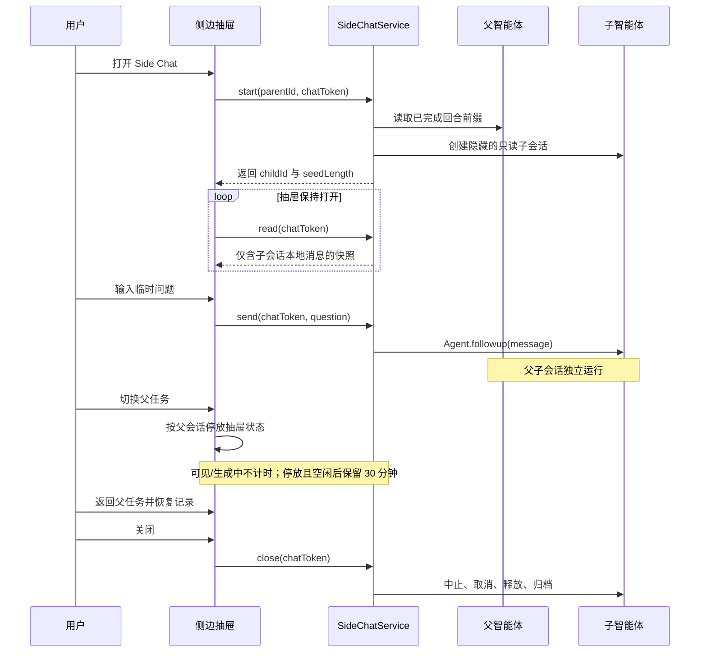

<p align="center">
  
</p>

<h1 align="center">dsh-side-chat</h1>

<p align="center">
  为 DeepSeek Harness 提供 Codex 风格的临时侧边对话。
</p>

<p align="center">
  <a href="README.md">English</a> · <a href="README.zh.md">简体中文</a>
</p>

<p align="center">
  
  
  
</p>

> **临时问一句，主任务不跑偏。** 打开继承父会话已完成上下文的侧栏，处理一个临时问题；关闭后，这段问答不会被写回主会话。

<p align="center">
  
</p>

## 为什么需要 Side Chat？

长时间的编码会话会持续积累决策、计划和进行中的工作。一个小问题也可能让主智能体偏离原有轨迹。Side Chat 把临时追问放进独立的子运行时，同时保持主会话可见、可运行、互不写入。

- **一键侧栏：** 在会话标题栏中增加按钮，并根据空间自动选择完整右栏、紧凑右栏或底部抽屉。
- **碰撞感知布局：** 测量实际 AppFrame、原生侧栏/详情栏、同层插件和已标记 Portal 控件，不替换任何原生 single slot。
- **继承上下文：** 只复制到最近一次已完成的 `turn/end`，绝不继承半截运行中的回合。
- **父会话独立：** 主会话继续运行；子会话不会向父会话回报，也不会追加 follow-up。
- **默认只读：** 同时使用只读沙箱、禁止审批、模型可见工具白名单和执行时拒绝未知工具的守卫。
- **按任务保留：** 切换父会话只会停放 Side Chat，不会删除；返回时恢复原记录和实时子会话。
- **明确结束条件：** 抽屉可见或正在生成时不会倒计时；主动关闭立即结束，停放且空闲 30 分钟后由 Host 自动清理。
- **实时消息流：** Host 只投影子会话本地消息，抽屉以 220–700 毫秒自适应刷新。
- **中英文界面：** 自动跟随 Harness 当前语言。
- **键盘入口：** 按 `Cmd/Ctrl + Shift + .` 打开或关闭。

## 安装

### 从 GitHub 安装

```bash
dsh plugin --profile web add github:Lukeknow0/dsh-side-chat
```

安装后重启正在运行的 `dsh web` 进程，再刷新现有 Harness 页面。

### 从本地源码安装

```bash
git clone https://github.com/Lukeknow0/dsh-side-chat.git
cd dsh-side-chat
pnpm install
pnpm run check
dsh plugin --profile web add .
```

如果你直接从 DeepSeek Harness 源码仓库运行 CLI，可使用仓库脚本：

```bash
pnpm dsh plugin --profile web add /absolute/path/to/dsh-side-chat
```

## 使用方法

1. 在普通父会话中至少完成一轮对话。
2. 点击会话标题栏中的 **Side Chat / 侧边对话**，或按 `Cmd/Ctrl + Shift + .`。
3. 输入一个聚焦的临时问题。侧边智能体可以读取继承的上下文和只读资源；面板或窗口尺寸变化时，抽屉会在不重新挂载的情况下调整位置。
4. 可以自由切换任务：抽屉会按父会话停放，返回时自动恢复原来的对话记录。
5. 真正想结束该 Side Chat 时，再点击关闭、按 Escape、再次使用快捷键或标题栏按钮。

每个父会话同一时间保留一个 Side Chat。抽屉可见或子会话正在生成时不消耗保留时间；抽屉被停放或断开且子会话空闲后，Host 再保留 30 分钟。主动关闭会立即结束。页面重新加载后，再次打开 Side Chat 也能在有效期内重新接回 Host 中保留的对话。

## 安全模型

Side Chat 对子智能体叠加四层单调收紧的控制：

| 层级 | 行为 |
| --- | --- |
| 分叉边界 | 只复制到最近已完成回合为止的平衡事件前缀 |
| 策略覆盖 | 在继承种子之后追加 `sandboxMode: read-only` 与 `approvalPolicy: never` |
| 工具可见性 | 仅展示父组合中确实存在的只读工具 |
| 执行守卫 | 拒绝所有未知或非只读工具，包括 Code Mode 的嵌套分发 |

执行守卫是最后一道权威边界。Harness 将来新增工具时，Side Chat 不会自动获得该能力。

### 重要的清理语义说明

**在 DSH 0.1.0-rc.7 中，“临时”不等于保证物理擦除。** 该版本没有公开的持久会话日志删除 API。主动关闭或空闲超时后，本插件会：

1. 先撤销客户端入口并忽略所有晚到回调；
2. 中止尚未完成的创建，或取消正在运行的生成；
3. 释放实时 `AgentHandle`，把子会话从活动运行时移除；
4. 在公开归档服务可用时调用工作区归档 API。

归档后的会话日志仍可能保留在磁盘上。本项目不会绕过公开 API 删除私有持久化文件，也不会依赖不稳定的内部存储路径。详见 [SECURITY.md](SECURITY.md)。

## 工作原理



子会话使用 `origin: subagent` 标记，但刻意不写入持久 `parentSession` 目录关联，因此既不会出现在工作区树，也不会残留在父会话的子代理目录中；抽屉持有不透明 token 期间，只有 Host 拥有提交问题的权限。

## 兼容性

| 组件 | 支持范围 |
| --- | --- |
| DeepSeek Harness | `>=0.1.0-rc.7 <0.2.0` |
| Node.js | `^22.19.0 || >=24.0.0` |
| 浏览器 | DSH Web 支持的当前 Chromium、Safari、Firefox |
| 开发包管理器 | pnpm 11.7 |

开发依赖使用一致的 rc.8 包集合，公开 peer 范围则包含 rc.7。本插件也会安装到本机 DSH 0.1.0-rc.7 源码环境并完成启动验证。目前已发布的若干 rc.7 包会通过 caret peer 解析到 rc.8；在独立插件项目里强行把每个开发依赖都钉死到 rc.7，会产生重复类型宇宙，反而不等同于真实应用安装。

## 开发

```bash
pnpm install
pnpm run typecheck
pnpm run test
pnpm run build
pnpm run smoke
pnpm run check
```

`pnpm run check` 会依次执行 lint、三套严格 TypeScript 检查、单元测试、Host 与浏览器构建、运行时冒烟断言以及 publint。

### 目录结构

```text
src/
  host/                 Host 侧子会话生命周期
  shared/               Zod 契约与工具策略
  client/               抽屉、控制器、语言包、远程接口
  remote-descriptors.ts Typert RPC 描述
tests/                   边界、策略、契约与包结构测试
docs/assets/             广告图和真实安装效果图
```

## 视觉系统

品牌符号由两条平行轨道组成，其中一条短暂分叉，表达“问题暂时偏离，但主轨迹不被改变”。

- 近黑：`#0B0D0E`
- 暖白：`#F2F0E8`
- 酸性薄荷绿：`#B7E85B`
- 低饱和珊瑚红：`#E9705B`

抽屉本身使用 DSH 官方设计 token 与基础组件，因此会跟随当前主题，同时保留薄荷绿分叉强调色。完整品牌板见 [`docs/assets/brand-board.png`](docs/assets/brand-board.png)。

## 当前状态

这是一个 MVP，公开 API 可能在 1.0 前调整。以下不变量不会轻易改变：安全的已完成回合分叉、禁止写入、不修改父会话、每个父会话只保留一个 Side Chat、切换任务可恢复、主动关闭或空闲超时才清理。

## 许可证与致谢

MIT，详见 [LICENSE](LICENSE) 与 [THIRD_PARTY_NOTICES.md](THIRD_PARTY_NOTICES.md)。

架构调研参考了 MIT 许可的 [dsh-nested-followups](https://github.com/sluminositys/dsh-nested-followups) 以及 DeepSeek Harness 官方源码。本项目没有整文件搬运其源代码。

DeepSeek Harness 与 Codex 商标归各自所有者。本项目与 DeepSeek、OpenAI 均无隶属关系。
